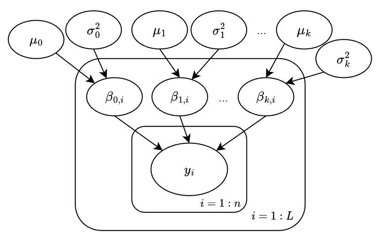

\newpage

```{r, warning=FALSE, results="hide", message=FALSE, echo=FALSE}
library(ggplot2)
library(posterior)
library(bayesplot)
library(rstan)
library(ggpubr)
library(tidyr)
library(dplyr)
library(ggcorrplot)
library(gridExtra)
library(plyr)
library(loo)
library(invgamma)

set.seed(123)
credit_risk <- read.csv(file="Resources/german_credit_data.csv")
summary(credit_risk)
credit_risk <- subset(credit_risk, select=-c(`X`))
```

# Introdução

Um dos serviços mais importantes oferecidos pelos bancos, e que atrai seus clientes, é a concessão de crédito. No entanto, quando instituições financeiras oferecem empréstimos imobiliários, financiamentos de veículos ou crédito empresarial, existe um risco inerente de que os tomadores não cumpram com seus pagamentos, o que é conhecido como risco de crédito. O risco de crédito é universalmente definido como a possibilidade de perda para o credor decorrente da incapacidade do tomador de honrar suas obrigações financeiras. Quando esse risco é mal gerenciado pelas instituições financeiras, as consequências podem ser catastróficas. O colapso do mercado imobiliário em 2008 e a recessão subsequente ilustram claramente a gravidade desse problema: em poucos meses, o sistema bancário esteve próximo do colapso devido à elevada exposição a inadimplências. Dessa forma, torna-se essencial avaliar a capacidade dos tomadores de cumprir suas obrigações financeiras, bem como os riscos envolvidos nesse processo, o que é conhecido como análise de risco de crédito.

A escolha desse tema se deve à sua relevância e importância para o mercado de crédito, bem como ao fato de existirem relativamente poucos projetos de análise de dados baseados em métodos bayesianos aplicados a esse contexto. O objetivo deste trabalho é utilizar regressão logística para identificar o risco associado a um empréstimo, classificando-o como um bom ou mau crédito. Para isso, serão aplicados um modelo pooled e um modelo hierárquico, permitindo a comparação dos resultados e a identificação do modelo com melhor desempenho para o problema proposto.

O relatório está organizado da seguinte forma: Introdução, Descrição dos Dados, Modelos, Resultados, Discussão, Conclusão e Apêndices. Inicialmente, formulamos o problema e descrevemos o tratamento dos dados por meio de procedimentos de pré-processamento e seleção de variáveis. Na seção de Modelos, apresentamos os dois modelos implementados em Stan, bem como a justificativa para a escolha de suas funções de verossimilhança e especificações. Na seção de Resultados, analisamos o desempenho dos modelos utilizando diagnósticos de convergência, verificações preditivas a posteriori, avaliação do desempenho preditivo, comparação entre modelos e análise de sensibilidade aos priors. Por fim, nas seções de Discussão e Conclusão, abordamos as limitações dos modelos, possíveis melhorias e alguns insights relevantes obtidos ao longo do desenvolvimento do projeto. Os Apêndices incluem todos os códigos em Stan utilizados neste estudo. Os modelos em Stan, bem como o código completo em R, podem ser encontrados [aqui](https://github.com/Hungreeee/Credit-Risk-Analysis).

# Descrição dos Dados
O conjunto de dados foi obtido por meio da plataforma Kaggle. Ele contém 1.000 observações coletadas, nesse conjunto de dados, cada observação representa um indivíduo que obteve crédito junto a uma instituição financeira, sendo classificado como apresentando bom ou mau risco de crédito, de acordo com um conjunto de atributos associados. O conjunto de dados completo pode ser encontrado em [aqui](https://www.kaggle.com/datasets/kabure/german-credit-data-with-risk).

O conjunto de dados é composto por 10 colunas, sendo 9 variáveis explicativas e 1 variável resposta, definidas a seguir:

Variáveis explicativas:

- Age (numerical/continuous): A idade do indivíduo.
- Duration (numerical/continuous): O prazo contratado do empréstimo (em meses).
- Credit.amount (numerical/continuous): O valor do crédito do empréstimo do indivíduo.
- Sex (textual/categorical): O sexo do indivíduo. Inclui "`male`" e "`female`".
- Job (numerical/categorical): O nível de ocupação do indivíduo. Inclui "`0`" - não qualificado e não residente, "`1`" - não qualificado e residente, "`2`" - qualificado, "`3`" - altamente qualificado.
- Housing (textual/categorical): O tipo de moradia do indivíduo. Inclui "`own`", "`rent`" e "`free`".
- Saving.accounts (textual/categorical): O nível de recursos da conta poupança do indivíduo. Inclui "`little`", "`moderate`", "`quite rich`", "`rich`".
- Checking.account (textual/categorical): O nível de recursos da conta corrente do indivíduo. Inclui "`little`", "`moderate`", "`quite rich`", "`rich`".
- Purpose (textual/categorical): A finalidade do empréstimo do indivíduo. Inclui "`business`", "`car`", "`domestic appliances`", "`education`", "`furniture/equipemt`", "`radio/TV`", "`repairs`", "`vacation/others`".


Variável resposta:

- Risk (textual/categorical): Indica se o indivíduo entrou em inadimplência (não pagamento do empréstimo). Inclui "`good`" – bom crédito (o indivíduo pagou o empréstimo em dia) e "`bad`" – mau crédito (o indivíduo entrou em inadimplência).

O conjunto de dados apresenta valores ausentes: as colunas Saving.accounts e Checking.account contêm valores `NA` (dados faltantes), correspondendo a $18.3$% e $39.4$% do total de observações, respectivamente.

```{r, echo=FALSE, comment=""}
isNA <- function(x){sum(is.na(x))/length(x)*100}
apply(credit_risk, 2, isNA)
```

## Pré-processamento e Limpeza dos Dados
Podemos explorar os dados por meio da construção de histogramas das variáveis explicativas em relação aos seus respectivos valores da variável resposta. Esses histogramas permitem obter insights sobre a relação entre as variáveis explicativas (features) e a variável resposta Risk.

```{r, echo=FALSE}
ageplot <- ggplot(credit_risk, aes(x=Age, y=Risk, color=Risk)) +
  labs(y="") +
  geom_point(size=3) + theme(axis.text=element_text(size=16),
        axis.title=element_text(size=20), legend.text=element_text(size=20), legend.title =element_text(size=20) )

sexplot <- ggplot(credit_risk, aes(x=Sex, fill=Risk)) +
  labs(y="") +
  geom_bar()+ theme(axis.text=element_text(size=16),
        axis.title=element_text(size=20))+ guides(fill="none")

jobplot <- ggplot(credit_risk, aes(x=Job, fill=Risk)) + guides(fill="none")+
  labs(y="") +
  geom_bar()+ theme(axis.text=element_text(size=16),
        axis.title=element_text(size=20))

housingplot <- ggplot(credit_risk, aes(x=Housing, fill=Risk))+
  labs(y="") + guides(fill="none") +
  geom_bar()+ theme(axis.text=element_text(size=16),
        axis.title=element_text(size=20))

savingplot <- ggplot(credit_risk, aes(x=Saving.accounts, fill=Risk)) + guides(fill="none")+
  labs(y="") +
  geom_bar()+ theme(axis.text=element_text(size=16),
        axis.title=element_text(size=20))

checking_plot <- ggplot(credit_risk, aes(x=Checking.account, fill=Risk))+ guides(fill="none") +
  labs(y="") +
  geom_bar()+ theme(axis.text=element_text(size=16),
        axis.title=element_text(size=20))

credit_plot <- ggplot(credit_risk, aes(x=Credit.amount, y=Risk, color=Risk)) + guides(fill="none")+
  labs(y="") +
  geom_point(size=3)+ theme(axis.text=element_text(size=16),
        axis.title=element_text(size=20))

duration <- ggplot(credit_risk, aes(x=Duration, y=Risk, color=Risk))+ guides(fill="none") +
  labs(y="") +
  geom_point(size=3)+ theme(axis.text=element_text(size=16),
        axis.title=element_text(size=20))

purpose_plot <- ggplot(credit_risk, aes(x=Purpose, fill=Risk)) +
  labs(y="") +
  geom_bar() + guides(fill="none") + 
  theme(legend.position="top")+ theme(axis.text=element_text(size=16),
        axis.title=element_text(size=20))
```

```{r, echo=FALSE, message=FALSE, warning=FALSE, results='hide', fig.align='center', fig.height=6, fig.width=10}
library(patchwork)
ageplot        <- ageplot + theme(legend.position = "none")
credit_plot   <- credit_plot + theme(legend.position = "none")
duration      <- duration + theme(legend.position = "none")
housingplot   <- housingplot + theme(legend.position = "none")
jobplot       <- jobplot + theme(legend.position = "none")
sexplot       <- sexplot + theme(legend.position = "none")
savingplot    <- savingplot + theme(legend.position = "none")
checking_plot <- checking_plot + theme(legend.position = "none")

row1 <- ageplot + credit_plot + duration
row2 <- housingplot + jobplot + sexplot
row3 <- savingplot + checking_plot
row4 <- purpose_plot

(row1 / row2 / row3 / row4) +
  plot_layout(heights = c(1.2, 1, 1, 1)) +
  plot_annotation(title = "Exploratory Data Analysis")
```
Existem diversos problemas que podem ser observados a partir dos histogramas:

- As variáveis Saving.accounts e Checking.account apresentam valores `NA` (o que também é indicado na seção de descrição do conjunto de dados).
- As variáveis contínuas Credit.amount e Duration apresentam outliers pontuais, uma vez que seus histogramas mostram valores significativamente maiores que se destacam claramente do restante da população.
- As variáveis discretas Saving.accounts e Purpose apresentam alto nível de dispersão, ou seja, seus histogramas indicam que os dados foram categorizados em muitos grupos, sendo que alguns desses grupos possuem um número relativamente baixo de observações.


Foram adotadas as seguintes soluções para esses problemas:

- Para lidar com a elevada proporção de valores `NA` presente em duas das variáveis, optou-se por imputar os dados ausentes utilizando a moda (valor mais frequente), que, de acordo com os gráficos, corresponde à categoria "`little`". A imputação pela moda é um método amplamente utilizado para o preenchimento de dados ausentes em variáveis categóricas, especialmente quando os dados são desbalanceados e fortemente concentrados na categoria mais frequente, como ocorre em Saving.accounts e Checking.account.

- Para tratar os outliers observados nas variáveis Credit.amount e Duration, optou-se por removê-los do conjunto de dados, uma vez que correspondem a um número muito reduzido de observações. No caso de Credit.amount, o maior valor foi removido; para Duration, o outlier também corresponde a uma única observação, sendo assim excluído o valor máximo da variável.

- Para reduzir o alto nível de esparsidade observado nas variáveis Saving.accounts e Purpose, uma possível solução foi a agregação de categorias com baixa frequência a categorias semanticamente semelhantes. No caso de Saving.accounts, as categorias "`rich`" e "`quite rich`" foram agrupadas em "`rich`"; para Purpose, as categorias "`domestic appliances`" e "`furniture/equipment`" foram agrupadas em "`furniture/equipment`", enquanto "`repairs`" e "`vacation/others`" foram agrupadas em "`others`". Essa abordagem reduz a dispersão dos dados e contribui para a obtenção de resultados mais robustos nos modelos construídos posteriormente.

Um passo adicional, porém fundamental, aplicado aos dados foi a padronização. O conjunto de dados é composto por variáveis de diferentes naturezas (categóricas, numéricas e textuais) e com escalas distintas, de modo que a padronização é essencial para melhorar o desempenho dos modelos. Além disso, a padronização facilita o processo de escolha dos priors para as variáveis explicativas, uma vez que todas passam a estar na mesma escala. Para esse fim, todas as variáveis (incluindo a variável resposta) foram inicialmente transformadas em valores numéricos. Em seguida, as variáveis explicativas foram escalonadas de forma que apresentassem média igual a $0$ e desvio padrão igual a $1$.


```{r, echo=FALSE, message=FALSE, warning=FALSE, results='hide'}
# Impute NA
get_mode <- function(x) {
  ux <- unique(x)
  ux <- na.omit(ux)
  ux[which.max(tabulate(match(x, ux)))]
}

credit_risk$`Saving.accounts`[is.na(credit_risk$`Saving.accounts`)] <- get_mode(credit_risk$`Saving.accounts`)
credit_risk$`Checking.account`[is.na(credit_risk$`Checking.account`)] <- get_mode(credit_risk$`Checking.account`)

miss <- function(x){sum(is.na(x))/length(x)*100}
apply(credit_risk, 2, miss)

# Merge sparse values
credit_risk$Purpose <- plyr::mapvalues(credit_risk$Purpose,
                                       from = c("business","car","domestic appliances",
                                      "education","furniture/equipment","radio/TV","repairs","vacation/others"), 
                                      to = c("business","car","furniture/equipment","education",
                                             "furniture/equipment","radio/TV","others","others")) 
credit_risk$Saving.accounts <- plyr::mapvalues(credit_risk$Saving.accounts, 
                                         from =c("little","moderate","quite rich","rich"), 
                                         to = c("little","moderate","rich","rich"))

# Remove outliers
credit_risk <- credit_risk[credit_risk$Credit.amount < max(credit_risk$Credit.amount),]
credit_risk <- credit_risk[credit_risk$Duration < max(credit_risk$Duration),]


# Suffle data
credit_risk <- credit_risk[sample(nrow(credit_risk)), ]


# Convert data into numerical data
credit_risk$Sex = as.numeric(factor(credit_risk$Sex))
credit_risk$Housing = as.numeric(factor(credit_risk$Housing))
credit_risk$Saving.accounts = as.numeric(factor(credit_risk$Saving.accounts))
credit_risk$Checking.account = as.numeric(factor(credit_risk$Checking.account))
credit_risk$Purpose = as.numeric(factor(credit_risk$Purpose))
credit_risk$Risk = as.numeric(factor(credit_risk$Risk)) - 1

# Standardize data
data_pooled <- credit_risk %>% mutate_at(colnames(credit_risk)[!colnames(credit_risk) %in% c("Risk")], ~(scale(.) %>% as.vector))
data_hierarchical <- credit_risk %>% mutate_at(colnames(credit_risk)[!colnames(credit_risk) %in% c("Risk", "Purpose")], ~(scale(.) %>% as.vector))
```

## Análise das Variáveis Explicativas
Podemos selecionar as variáveis explicativas finais para os modelos por meio da utilização de uma matriz de correlação, a qual permite visualizar o nível de correlação entre cada uma das variáveis.

```{r, r, echo=FALSE, message=FALSE, warning=FALSE, results='hide', out.width='70%', fig.align='center'}
ggcorrplot(cor(credit_risk), lab = TRUE, lab_size = 3)
```

A partir do gráfico de correlação, observa-se que não há correlação superior a $0.9$ entre as variáveis explicativas, indicando a ausência de multicolinearidade significativa. No entanto, nota-se que a variável Housing apresenta a menor correlação com a variável resposta (apenas $-0.02$), o que sugere que sua contribuição para o processo de amostragem é bastante limitada. Esse aspecto deve ser considerado, uma vez que, posteriormente, serão adotadas medidas para reduzir sua influência nos resultados.

Em síntese, para o modelo pooled, as variáveis explicativas selecionadas são Age, Sex, Job, Housing, Saving.accounts, Checking.account, Duration e Purpose, sendo Housing a variável com menor correlação em relação à variável resposta. Para o modelo hierárquico, as variáveis permanecem as mesmas; entretanto, a variável Purpose passa a ser utilizada como variável de agrupamento hierárquico e, portanto, é excluída do conjunto de variáveis explicativas. A variável resposta adotada em ambos os modelos é Risk.

# Descrição dos Modelos

Neste projeto, dois modelos serão utilizados e analisados: um modelo pooled e um modelo hierárquico. Como modelo estatístico, optou-se pela Regressão Logística, uma vez que o objetivo do estudo é classificar um desfecho binário (mau crédito: "0", bom crédito: "1"). A probabilidade $p$ de ocorrência de um evento é calculada considerando que o log-odds desse evento é modelado como uma combinação linear de uma ou mais variáveis independentes, correspondentes às variáveis explicativas selecionadas.


## Modelo de Regressão Logística Pooled
O modelo de Regressão Logística é utilizado para classificar o risco $y$ na concessão de um empréstimo com base na observação $x$. Seu preditor $p$ é parametrizado por um intercepto $\beta_0$ e por coeficientes associados às variáveis explicativas $\beta_1, \beta_2, \ldots, \beta_k$, conforme descrito a seguir:
\[
\begin{aligned}
p &= \frac {e^{\beta_0+\beta_1 x_{n,1}+...+\beta_k x_{n,k}}} {1-e^{\beta_0+\beta_1 x_{n,1}+...+\beta_k x_{n,k}}} \\
&= logit^{-1}(\beta_0+\beta_1 x_{n,1}+...+\beta_k x_{n,k})
\end{aligned}
\]
A variável resposta $y$, associada às observações $x$, segue a seguinte distribuição:
$$
y_n \sim Bernoulli(p)=Bernoulli(logit^{-1}(\beta_0+\beta_1 x_{n,1}+...+\beta_k x_{n,k}))
$$
em que $\beta_0$ representa o intercepto e cada $\beta_1, \beta_2, \ldots, \beta_k$ corresponde ao coeficiente de regressão associado a cada variável explicativa.

### Justificativa das Priors
Devido à padronização dos dados, é possível assumir um prior fracamente informativo genérico, amplamente utilizado, para os coeficientes associados às variáveis explicativas:
$$
\beta_0, \beta_1,...,\beta_k \sim \mathcal{N}(0, 1)
$$
A distribuição Normal com parâmetro de localização igual a 0 expressa o reduzido conhecimento prévio sobre como variações nas variáveis de entrada afetam a variável resposta prevista, enquanto o desvio padrão igual a 1 amplia a forma da distribuição, permitindo uma concentração suave dos valores dentro da escala, o que a torna suficientemente fracamente informativa para os dados padronizados.

Entretanto, conforme observado anteriormente, para a variável potencialmente irrelevante Housing, que corresponde ao coeficiente $\beta_3$, assume-se um prior informativo:
$$
\beta_3 \sim \mathcal{N}(0, 0.01)
$$
Esse prior informativo atua como um poderoso prior de regularização, ao restringir o coeficiente pouco significativo $\beta_3$ a valores próximos de zero, sem, contudo, eliminá-lo completamente do modelo, reduzindo assim sua influência sobre os resultados. Essa ideia de shrinkage (contração dos efeitos) é utilizada como justificativa para a seleção de modelos, conforme discutido em [Hahn et al. (2014)](#references). 

### Execução do Modelo
Antes da execução do modelo, o conjunto de dados de entrada foi dividido em conjuntos de treinamento e teste, em proporções iguais (metade dos dados para cada conjunto). O conjunto de treinamento foi utilizado no processo de amostragem do modelo, enquanto o conjunto de teste foi empregado para a realização de previsões e para a avaliação da acurácia do modelo.
```{r, comment=""}
train_size <- round(nrow(data_pooled)/2, 0)
test_size <- nrow(data_pooled) - train_size
cat("Train size:", train_size, "/ Test size:", test_size)
```

O modelo é então executado com 4 cadeias, 2.000 iterações e 1.000 iterações de aquecimento (warm-up).

```{r, message=FALSE, warning=FALSE, results='hide'}
# Create train and test sets
data_train <- head(data_pooled, train_size)
data_test <- tail(data_pooled, test_size)

# Create train and test target
y_train_pooled = data_train$Risk
y_test_pooled = data_test$Risk

# Create train and test observations
X_train_pooled = subset(data_train, select=-c(`Risk`)) 
X_test_pooled = subset(data_test, select=-c(`Risk`)) 

# Create combined data
credit_data_pooled <- list(N_train=nrow(X_train_pooled), 
                            K=ncol(X_train_pooled), 
                            X_train=X_train_pooled, 
                            y_train=y_train_pooled,
                            N_test=nrow(X_test_pooled),
                            X_test=X_test_pooled)

# Load and run data
pooled_fit <- stan(file="Models/pooled.stan", 
                   data=credit_data_pooled, 
                   chains=4, iter=2000, warmup=1000)
```

## Modelo de Regressão Logística Hierárquico

O modelo hierárquico, embora utilize Regressão Logística de forma semelhante ao modelo pooled, é relativamente mais complexo. Conforme discutido na seção de Análise das Variáveis Explicativas, os dados são categorizados em $L$ grupos utilizando a variável categórica Purpose. Os coeficientes $\beta_0, \beta_1, \ldots, \beta_k$ são então amostrados separadamente para cada um dos $L$ grupos, a partir de seus próprios hiperparâmetros $\mu$ e $\sigma^2$. A estrutura do modelo pode ser descrita conforme apresentado a seguir:

```{r echo=FALSE, out.width='50%', fig.align='center'}

```

Como cada um dos $L$ grupos possui seus próprios coeficientes $\beta_0, \beta_1, \ldots, \beta_k$, amostrados de forma independente, é possível construir uma equação de Regressão Logística para a variável resposta:
\[
\begin{gathered}
y_n \sim Bernoulli(logit^{-1}(\beta_{0,L(n)}+\beta_{1,L(n)} x_{n,1}+...+\beta_{k,L(n)} x_{n,k})),\\ \text{ with }L(n) \text{ being the group of the }n^{th} \text{ data}\\
\end{gathered}
\]

### Justificativa das Priors
Podemos estimar os coeficientes $\beta_{0,L(n)}, \beta_{1,L(n)}, \ldots, \beta_{k,L(n)}$ utilizando um prior Normal com hiperparâmetros $\mu$ e $\sigma^2$.:
$$
\beta_{i,L(n)} \sim \mathcal{N}(\mu_i, \sigma_i^2), \text{ with }i=1:k
$$
Para o hiperparâmetro $\mu_i$, assume-se o mesmo prior fracamente informativo genérico:
$$
\mu_i \sim \mathcal{N}(0, 1)
$$
Observe que, em função da etapa de padronização, esse prior é considerado suficientemente fracamente informativo, de modo a não introduzir vieses no modelo. A escolha desse prior já foi discutida anteriormente no contexto do modelo pooled.

Para o hiperparâmetro $\sigma^2$, assume-se um prior inverso-gama fracamente informativo:
$$
\sigma_i^2 \sim InvGamma(0.5, 1)
$$
Na modelagem hierárquica, a distribuição inverso-gama é um prior comumente utilizado para a estimação de hiper-variâncias. A forma da distribuição $InvGamma(0.5, 1)$ apresenta uma cauda direita ampla e pesada, indicando que a variância é estritamente positiva e que o prior é fracamente informativo, o que o torna adequado para a estimação de $\sigma^2$.

Para a variável Housing, considerada fracamente significativa, assume-se, de forma semelhante ao modelo anterior, priors de regularização informativos para os hiperparâmetros:
\[
\begin{gathered}
\mu_3 \sim \mathcal{N}(0, 0.01) \\
\sigma^2_3 \sim InvGamma(1, 0.01)
\end{gathered}
\]
Os priors $\mathcal{N}(0, 0.01)$ e $InvGamma(1, 0.01)$ são fortemente informativos, pois ambos ajustam a média e a variância a priori da variável Housing para valores próximos de zero. Conforme explicado no modelo anterior, essa especificação tem como objetivo reduzir (shrink) o efeito da variável potencialmente irrelevante Housing sobre o processo de amostragem do modelo.

### Executando o modelo
Antes da execução, os dados de entrada foram divididos em conjuntos de treinamento e teste em proporções iguais (50% dos dados para cada conjunto). Enquanto o conjunto de treinamento é utilizado no processo de amostragem do modelo, o conjunto de teste é empregado para fins de predição e avaliação da acurácia.
```{r, comment=""}
train_size <- round(nrow(data_hierarchical)/2, 0)
test_size <- nrow(data_hierarchical) - train_size
cat("Train size:", train_size, "/ Test size:", test_size)
```

O modelo é então executado com 4 cadeias, 2000 iterações e 1000 iterações de aquecimento (warm-up).
```{r, message=FALSE, results='hide'}
# Create train and test sets
data_train <- head(data_hierarchical, train_size)
data_test <- tail(data_hierarchical, test_size)

# Create train and test target 
y_train_hierarchical = data_train$Risk
y_test_hierarchical = data_test$Risk

# Create train and test observations
X_train_hierarchical = subset(data_train, select=-c(`Risk`, `Purpose`)) 
X_test_hierarchical = subset(data_test, select=-c(`Risk`, `Purpose`)) 

# Create train and test hierarchical groupings
ll_train = data_train$Purpose
ll_test = data_test$Purpose

# Create combined data
credit_data_hierarchical <- list(N_train=nrow(X_train_hierarchical), 
                                  K=ncol(X_train_hierarchical), 
                                  L_train=length(unique(ll_train)),
                                  ll_train=ll_train,
                                  X_train=X_train_hierarchical, 
                                  y_train=y_train_hierarchical,
                                  N_test=nrow(X_test_hierarchical),
                                  L_test=length(unique(ll_test)),
                                  ll_test=ll_test,
                                  X_test=X_test_hierarchical)

# Load and run data
hierarchical_fit <- stan(file="Models/hierarchical.stan", 
                         data=credit_data_hierarchical, 
                         chains=4, iter=2000, warmup=1000)
```

# Análise dos resultados

## Diagnósticos de convergência

### Diagnóstico $\hat{R}$
Os valores de $\hat{R}$ dos modelos são apresentados em histogramas:


```{r, warning=FALSE, message=FALSE, results='hide', echo=FALSE, out.width='80%', fig.align='center'}
r_hat_pooled = summary(pooled_fit)$summary[,"Rhat"]
r_hat_hierarhical = summary(hierarchical_fit)$summary[,"Rhat"]

rhat_pooled <- mcmc_rhat_hist(r_hat_pooled) + 
  labs(title="Pooled model")  +
  theme(plot.title = element_text(hjust = 0.5))

rhat_hierarchical <- mcmc_rhat_hist(r_hat_hierarhical) + 
  labs(title="Hierarchical model")  +
  theme(plot.title = element_text(hjust = 0.5))

ggarrange(rhat_pooled, rhat_hierarchical, ncol=2, common.legend=TRUE)
```
Os histogramas mostram claramente que todos os valores de $\hat{R}$ são menores que $1.05$, e que suas distribuições estão relativamente concentradas em torno de $1.00$. Isso sugere que as cadeias de MCMC de ambos os modelos convergiram adequadamente.

### Diagnóstico do tamanho efetivo da amostra (ESS)
Em vez de plotar diretamente o ESS, optou-se por apresentar outra métrica chamada razão do ESS, que é simplesmente definida como $N_{\text{eff}}/N_{\text{sample}}$, isto é, a razão entre o tamanho efetivo da amostra e o tamanho total da amostra.
```{r, warning=FALSE, message=FALSE, results='hide', echo=FALSE, out.width='80%', fig.align='center'}
ess_pooled <- mcmc_neff_hist(neff_ratio(pooled_fit)) + 
  labs(title="Pooled model")  +
  theme(plot.title = element_text(hjust = 0.5))
ess_hierarchical <- mcmc_neff_hist(neff_ratio(hierarchical_fit)) + 
  labs(title="Hierarchical model")  +
  theme(plot.title = element_text(hjust = 0.5))

ggarrange(ess_pooled, ess_hierarchical, ncol=2, common.legend=TRUE)
```
A partir do histograma do modelo pooled, embora o $N_{\text{eff}}$ apresente uma distribuição relativamente atípica para o tamanho efetivo da amostra, isso não representa motivo de preocupação. Mais importante, observa-se que a maioria das razões está concentrada em torno de $1.00$, e nenhuma razão é inferior a $0.1$, valor considerado um limiar crítico para a detecção de instabilidades no processo de amostragem, conforme [Gelman et al. (2013)](#references). Isso indica que tanto o modelo pooled quanto o modelo hierárquico são estáveis e que os resultados são confiáveis.

### Diagnósticos de divergências e profundidade da árvore
Podemos acessar os parâmetros do amostrador para ambos os modelos utilizando `get_sampler_params`:

Modelo Pooled:
```{r}
summary(do.call(rbind, get_sampler_params(pooled_fit, inc_warmup=FALSE)))
```

Hierarchical model:
```{r}
summary(do.call(rbind, get_sampler_params(hierarchical_fit, inc_warmup=FALSE)))
```
O amostrador NUTS de ambos os modelos não apresentou divergências, uma vez que todas as estatísticas de divergência permaneceram em 0. Além disso, observa-se que a profundidade máxima da árvore para ambos os modelos não ultrapassa o limiar 10, o que indica que o processo de amostragem não apresenta ineficiências computacionais e é estável.

## Verificações preditivas a posteriori
```{r, warning=FALSE, message=FALSE, results='hide', echo=FALSE, out.width='70%', fig.align='center'}
# Extract fit
ypred_pooled <- as.matrix(pooled_fit, pars="y_pred") 
ypred_hierarchical <- as.matrix(hierarchical_fit, pars="y_pred") 

pooled_dens <- ppc_dens_overlay(y_test_pooled, ypred_pooled[1:50, ]) + 
  labs(title="Pooled model")  +
  theme(plot.title = element_text(hjust = 0.5))
pooled_hist <- ppc_hist(y_test_pooled, ypred_pooled[1:5, ]) 

hierarchical_dens <- ppc_dens_overlay(y_test_hierarchical, ypred_hierarchical[1:50, ]) + 
  labs(title="Hierarchical model")  +
  theme(plot.title = element_text(hjust = 0.5))
hierarchical_hist <- ppc_hist(y_test_hierarchical, ypred_hierarchical[1:5, ]) 

ggarrange(pooled_dens, pooled_hist, hierarchical_dens, hierarchical_hist, nrow=2, common.legend=TRUE, legend="right")
```
Os gráficos de densidade apresentam as primeiras 50 predições, enquanto os histogramas utilizam as primeiras 5 predições dos dados de teste de ambos os modelos para comparação com os dados originais de teste. Embora exista uma pequena quantidade de ruído, é evidente que a distribuição das predições se assemelha à distribuição dos dados originais, o que indica que os modelos pooled e hierárquico geraram predições a posteriori robustas. Na seção de avaliação do desempenho preditivo, serão apresentados indicadores numéricos para avaliar de forma objetiva a capacidade preditiva de ambos os modelos.

## Comparação entre Modelos
A comparação entre os modelos é realizada por meio da validação cruzada leave-one-out (LOO-CV), a qual permite estimar o desempenho de generalização dos modelos.

Inicialmente, os valores de Pareto $k$ são plotados com o objetivo de avaliar a confiabilidade das estimativas de `elp`.
```{r, warning=FALSE, message=FALSE, results='hide', echo=FALSE, out.width='70%', fig.align='center'}
pooled_loo <- loo(pooled_fit)
hierarchical_loo <- loo(hierarchical_fit)

hierarchical_k <- ggplot() +
  geom_point(aes(x=1:length(hierarchical_loo$diagnostics$pareto_k), y=hierarchical_loo$diagnostics$pareto_k)) +
  scale_x_continuous(expand = c(0, 0)) + 
  scale_y_continuous(expand = c(0, 0), limits=c(min(0, min(hierarchical_loo$diagnostics$pareto_k)), 1), n.breaks=6) +
  geom_abline(slope=0, intercept=0.7, linetype="dashed", color="red") +
  geom_abline(slope=0, intercept=0.5, linetype="dashed", color="red") +
  labs(x="Data point", y="Pareto K value", title="Hierarchical model diagnostics") +
  theme(plot.title = element_text(hjust = 0.5)) 

pooled_k <- ggplot() +
  geom_point(aes(x=1:length(pooled_loo$diagnostics$pareto_k), y=pooled_loo$diagnostics$pareto_k)) +
  scale_x_continuous(expand = c(0, 0)) + 
  scale_y_continuous(expand = c(0, 0), limits=c(min(0, min(pooled_loo$diagnostics$pareto_k)), 1), n.breaks=6) +
  geom_abline(slope=0, intercept=0.7, linetype="dashed", color="red") +
  geom_abline(slope=0, intercept=0.5, linetype="dashed", color="red") +
  labs(x="Data point", y="Pareto K value", title="Pooled model diagnostics") +
  theme(plot.title = element_text(hjust = 0.5)) 

ggarrange(pooled_k, hierarchical_k, ncol=2)
```
Enquanto todos os valores de Pareto $k$ do modelo pooled estão abaixo de $0.5$, indicando que os resultados são altamente confiáveis, um dos valores de $k$ do modelo hierárquico excede $0.7$, que é usualmente considerado o limiar para valores problemáticos, sugerindo que a estimativa para o modelo hierárquico pode estar excessivamente otimista.

A estimativa LOO-CV de `elpd` para ambos os modelos é apresentada e comparada da seguinte forma:

Modelo Pooled:
```{r, warning=FALSE, comment=""}
pooled_loo
```

Hierarchical model:
```{r, warning=FALSE, comment=""}
hierarchical_loo
```

```{r, comment=""}
loo_compare(pooled_loo, hierarchical_loo)
```
A estimativa de `elpd` (escalada pelo erro padrão) do modelo pooled apresenta um valor superior ao do modelo hierárquico. Considerando ainda o fato de que o modelo hierárquico apresenta instabilidade, evidenciada por um valor elevado de Pareto $k$, isso sugere que o modelo pooled possui melhor desempenho e deve ser o preferido.

## Avaliação do desempenho preditivo
Para obter uma melhor compreensão do poder preditivo dos modelos, calcula-se a matriz de confusão para cada um deles. Para cada observação do conjunto de teste, computa-se a média das predições provenientes de 4000 cadeias. Se essa média for superior a 0.5, a predição é registrada como 1; caso contrário, a predição é arredondada para 0. Em seguida, as predições são comparadas com o conjunto de teste original, a fim de calcular os verdadeiros positivos (TP), falsos positivos (FP), verdadeiros negativos (TN) e falsos negativos (FN).
```{r, warning=FALSE, message=FALSE, results='hide', echo=FALSE}
confusion_matrix <- function(predictions, actual) {
  true_pos_count <- 0
  true_neg_count <- 0
  false_neg_count <- 0
  false_pos_count <- 0
  for(i in 1:ncol(predictions)) {
    label = paste(c("y_pred[",i,"]"), collapse="")
    predict = mean(predictions[ , label])
    if(predict >= 0.5 && actual[i] == 1) 
      true_pos_count <- true_pos_count + 1 
    else if(predict >= 0.5 && actual[i] == 0) 
      false_pos_count <- false_pos_count + 1
    else if(predict < 0.5 && actual[i] == 0) 
      true_neg_count <- true_neg_count + 1 
    else if(predict < 0.5 && actual[i] == 1) 
      false_neg_count <- false_neg_count + 1 
  }
  matrix(c(true_pos_count, false_pos_count, 
           false_neg_count, true_neg_count), 
         nrow=2, 
         dimnames=list(c("Predicted True", "Predicted False"), 
                       c("Actual True", "Actual False")))
}
```

Modelo Pooled:
```{r, warning=FALSE, message=FALSE, echo=FALSE, comment=""}
pooled_conf_mat <- confusion_matrix(ypred_pooled, y_test_pooled)
pooled_conf_mat
```

Modelo hierárquico:
```{r, warning=FALSE, message=FALSE, echo=FALSE, comment=""}
hierarchical_conf_mat <- confusion_matrix(ypred_hierarchical, y_test_hierarchical)
hierarchical_conf_mat
```
Duas métricas utilizadas para avaliar o desempenho preditivo dos modelos são a Acurácia, que mede a proporção de predições corretas em relação ao total de predições, e a Especificidade, que corresponde à proporção de predições negativas corretamente classificadas em relação ao total de observações negativas (empréstimos inadimplentes). Enquanto a acurácia avalia o desempenho global das predições dos modelos, a especificidade permite mensurar a capacidade de identificar corretamente um empréstimo ruim, o que é economicamente mais relevante. O principal objetivo dos bancos ao avaliar a capacidade de pagamento de um empréstimo é evitar empréstimos inadimplentes e, consequentemente, perdas financeiras. Dessa forma, além da acurácia, é fundamental considerar a especificidade na avaliação do poder preditivo dos modelos.

Essas métricas podem ser obtidas a partir da matriz de confusão da seguinte forma:
\[
\begin{gathered}
\text{Accuracy}=\frac{TP+TN}{TP+TN+FP+FN} \\
\text{Specificity}=\frac{TN}{TN+FP}
\end{gathered}
\]

```{r, warning=FALSE, message=FALSE, echo=FALSE, comment=""}
accuracy_pooled <- (pooled_conf_mat[1,1] + pooled_conf_mat[2, 2]) / 
  (pooled_conf_mat[1,1] + pooled_conf_mat[2, 2] + pooled_conf_mat[1,2] + pooled_conf_mat[2, 1])

accuracy_hierarchical <- (hierarchical_conf_mat[1,1] + hierarchical_conf_mat[2, 2]) / 
  (hierarchical_conf_mat[1,1] + hierarchical_conf_mat[2, 2] + hierarchical_conf_mat[1,2] + hierarchical_conf_mat[2, 1])

sens_pooled <- pooled_conf_mat[2,2]/ 
  (pooled_conf_mat[2, 2] + pooled_conf_mat[1,2])

sens_hierarchical <- hierarchical_conf_mat[2,2]/ 
  (hierarchical_conf_mat[2, 2] + hierarchical_conf_mat[1,2])

cat("Pooled model:\nAccuracy:", round(accuracy_pooled,2), "/ Specificity:", round(sens_pooled, 2), "\n\n")
cat("Hierarchical model:\nAccuracy:", round(accuracy_hierarchical, 2), "/ Specificity:", round(sens_hierarchical,2))
```

A partir das métricas obtidas acima, fica claro que as predições do modelo pooled para todos os tipos de empréstimos, e especialmente para os empréstimos inadimplentes, são consideravelmente mais robustas do que as do modelo hierárquico.

Em termos práticos, o modelo hierárquico não apresenta acurácia suficiente na predição de empréstimos inadimplentes (inferior a $50$%) para ser adotado na prática. Mesmo com uma acurácia global relativamente boa de $72$%, o modelo pooled possui apenas uma probabilidade de $50$% de identificar corretamente empréstimos inadimplentes, o que não é economicamente relevante. Dessa forma, nenhum dos dois modelos se mostra aplicável a casos reais de uso.

## Análise de sensibilidade dos priors
Para ambos os modelos, será considerado o intercepto da regressão $\beta_0$, analisando-se as mudanças em suas distribuições a posteriori sob diferentes especificações de priors.

No modelo pooled, o intercepto $\beta_0$ passa a assumir um prior relativamente mais informativo $\mathcal{N}(2, 0.3)$, em substituição ao prior original $\mathcal{N}(0, 1)$.

Já o modelo hierárquico mantém o prior $\mathcal{N}(\mu_0, \sigma_0)$ para o intercepto $\beta_{0,1}$, porém adota priors mais informativos para os hiperparâmetros: $\sigma_0 \sim \mathcal{N}(2, 0.3)$ e $\mu_0 \sim InvGamma(1, 0.1)$, em substituição aos priors originais $\mathcal{N}(0, 1)$ e $InvGamma(0.5, 1)$, respectivamente.

Essa análise é conduzida por meio do ajuste de um novo modelo, no qual a única diferença em relação ao modelo original reside nos priors aplicados a $\beta_0$ no modelo pooled e a $\sigma_0$ e $\mu_0$ no modelo hierárquico:
```{r, warning=FALSE, message=FALSE, results='hide'}
prior_pooled_fit <- stan(file="Models/prior_check_pooled.stan", 
                         data=credit_data_pooled, 
                         chains=4, iter=2000, warmup=1000)
prior_hierarchical_fit <- stan(file="Models/prior_check_hierarchical.stan", 
                               data=credit_data_hierarchical, 
                               chains=4, iter=2000, warmup=1000)
```
Todas as cadeias dos modelos utilizados na verificação de sensibilidade aos priors convergiram, e não foram observados avisos de divergência. Isso sugere que as escolhas alternativas de priors são suficientemente razoáveis para serem utilizadas como referência na avaliação da sensibilidade dos modelos.

A distribuição a posteriori obtida é comparada com a posterior original, juntamente com os novos e os antigos priors, da seguinte forma:
```{r, warning=FALSE, message=FALSE, results='hide', echo=FALSE, out.width='70%', fig.align='center'}
current_pooled_draws <- as_draws_df(pooled_fit)
prior_pooled_draws <- as_draws_df(prior_pooled_fit)

current_pooled_posterior <- as_tibble(current_pooled_draws$`beta_0`)
prior_pooled_posterior <- as_tibble(prior_pooled_draws$`beta_0`)

scale=seq(-5, 5.5, by=0.1)
       
current_pooled_prior <- tibble(x=scale, y=dnorm(scale, mean=0, sd=1))
tested_pooled_prior <- tibble(x=scale, y=dnorm(scale, mean=2, sd=0.3))

pooled_prior_comp <- ggplot() +
  geom_line(data=current_pooled_prior, aes(x=x, y=y)) +
  geom_area(data=current_pooled_prior, aes(x=x, y=y, fill="Original prior"), alpha=0.5) +
  geom_line(data=tested_pooled_prior, aes(x=x, y=y)) +
  geom_area(data=tested_pooled_prior, aes(x=x, y=y, fill="Alternative prior"), alpha=0.5) +
  scale_fill_manual(name="Priors", breaks=c("Original prior", "Alternative prior"), values=c("lightblue", "dodgerblue3")) +
  labs(x="beta_0", y="density") 
  

pooled_posterior_comp <- ggplot() +
  geom_density(data=current_pooled_posterior, aes(x=value, fill="Original prior"), alpha=0.5) +
  geom_density(data=prior_pooled_posterior, aes(x=value, fill="Alternative prior"), alpha=0.5) +
  scale_fill_manual(name="Priors", breaks=c("Original prior", "Alternative prior"), values=c("lightblue", "dodgerblue3")) +
  labs(x="beta_0 (Posterior)", y="density") 

annotate_figure(ggarrange(pooled_prior_comp, pooled_posterior_comp, ncol=2, common.legend=TRUE), top=text_grob("Pooled model")) 
```

```{r, warning=FALSE, message=FALSE, results='hide', echo=FALSE, out.width='70%', fig.align='center'}
current_hierarchical_draws <- as_draws_df(hierarchical_fit)
prior_hierarchical_draws <- as_draws_df(prior_hierarchical_fit)

current_hierarchical_posterior <- as_tibble(current_hierarchical_draws$`beta_0[1]`)
prior_hierarchical_posterior <- as_tibble(prior_hierarchical_draws$`beta_0[1]`)

scale <- seq(-5, 5.5, by=0.1)
       
current_hierarchical_prior_mu <- tibble(x=scale, y=dnorm(scale, mean=0, sd=1))
tested_hierarchical_prior_mu <- tibble(x=scale, y=dnorm(scale, mean=2, sd=0.3))

current_hierarchical_prior_sigma <- tibble(x=scale, y=dnorm(scale, mean=0, sd=1))
tested_hierarchical_prior_sigma <- tibble(x=scale, y=dnorm(scale, mean=2, sd=0.5))

hierarchical_prior_comp_mu <- ggplot() +
  geom_line(data=current_hierarchical_prior_mu, aes(x=x, y=y)) +
  geom_area(data=current_hierarchical_prior_mu, aes(x=x, y=y, fill="Original prior"), alpha=0.5) +
  geom_line(data=tested_hierarchical_prior_mu, aes(x=x, y=y)) +
  geom_area(data=tested_hierarchical_prior_mu, aes(x=x, y=y, fill="Alternative prior"), alpha=0.5) +
  scale_fill_manual(name="Priors", breaks=c("Original prior", "Alternative prior"), values=c("lightblue", "dodgerblue3")) +
  labs(x="mu_0", y="density") 

scale <- seq(0, 6.5, by=0.1)

current_hierarchical_prior_sigma <- tibble(x=scale, y=dinvgamma(scale, shape=0.5, rate=1))
tested_hierarchical_prior_sigma <- tibble(x=scale, y=dinvgamma(scale, shape=1, rate=0.1))

hierarchical_prior_comp_sigma <- ggplot() +
  geom_line(data=current_hierarchical_prior_sigma, aes(x=x, y=y)) +
  geom_area(data=current_hierarchical_prior_sigma, aes(x=x, y=y, fill="Original prior"), alpha=0.5) + 
  geom_line(data=tested_hierarchical_prior_sigma, aes(x=x, y=y)) +
  geom_area(data=tested_hierarchical_prior_sigma, aes(x=x, y=y, fill="Alternative prior"), alpha=0.5) +
  scale_fill_manual(name="Priors", breaks=c("Original prior", "Alternative prior"), values=c("lightblue", "dodgerblue3")) +
  labs(x="sigma_0", y="density") 

posterior_comp <- ggplot() +
  geom_density(data=current_hierarchical_posterior, aes(x=value, fill="Original prior"), alpha=0.5) +
  geom_density(data=prior_hierarchical_posterior, aes(x=value, fill="Alternative prior"), alpha=0.5) +
  scale_fill_manual(name="Priors", breaks=c("Original prior", "Alternative prior"), values=c("lightblue", "dodgerblue3")) +
  labs(x="beta_0_1 (Posterior)", y="density") 

annotate_figure(ggarrange(hierarchical_prior_comp_mu, hierarchical_prior_comp_sigma, posterior_comp, ncol=3, common.legend=TRUE), top=text_grob("Hierarchical model"))
```
Para o modelo pooled, era esperado que a posterior se deslocasse em função da alteração do parâmetro de localização do prior; no entanto, observa-se que esse deslocamento é apenas marginal. Mesmo com um parâmetro de escala consideravelmente menor para o prior, a forma da distribuição praticamente não se altera. No caso do modelo hierárquico, ainda que seja aplicado um hiperprior significativamente mais informativo, o formato resultante da distribuição a posteriori também não apresenta variações substanciais. Dessa forma, conclui-se que ambos os modelos são relativamente robustos a mudanças nas especificações dos priors.

# Conclusão e possíveis melhorias

## Conclusão
Este projeto teve como objetivo realizar a análise de dois modelos distintos de Regressão Logística, sendo o modelo pooled o que apresentou maior confiabilidade. Ambos os modelos alcançaram níveis relativamente bons de acurácia: aproximadamente $70$% para o modelo hierárquico e $72$% para o modelo pooled. No entanto, devido ao fraco desempenho na detecção de empréstimos inadimplentes — que constitui o principal objetivo de qualquer instituição concedente de crédito — nenhum dos dois modelos se mostra economicamente relevante ou adequado para aplicações em cenários reais. Ainda assim, os modelos produzem resultados robustos de forma geral e são úteis para fins de pesquisa, especialmente considerando a escassez de análises de risco de crédito baseadas em métodos bayesianos disponíveis na literatura.

## Limitações e possíveis melhorias
No início do projeto, enfrentaram-se dificuldades na definição de priors apropriados para os modelos. Como o conhecimento sobre o mercado de crédito era limitado, tornou-se desafiador assumir hipóteses mais concretas, sendo necessário recorrer a priors genéricos. Além disso, também houve diversos problemas relacionados ao uso do Stan. Inicialmente, o projeto foi desenvolvido utilizando cmdstan, porém essa interface apresenta compatibilidade limitada com outras bibliotecas, que geralmente exigem um objeto de ajuste do tipo rstan como parâmetro. Dessa forma, foi necessário migrar todo o fluxo de trabalho para rstan e reiniciar o desenvolvimento do projeto.

Há amplo espaço para melhorias no projeto. Uma delas diz respeito à imputação de dados ausentes. A variável Checking.account apresenta uma proporção elevada de valores ausentes (até $39.4$%), e a imputação pelo valor da moda não se mostrou a abordagem mais adequada. Como alternativa, poderia ser empregado o algoritmo dos $k$ vizinhos mais próximos ($k$-nearest neighbors), permitindo uma imputação mais precisa e reduzindo a introdução de vieses no modelo. Outra possibilidade de aprimoramento está no processo de definição dos priors. Com um aprofundamento maior na literatura sobre o mercado de crédito, seria possível incorporar distribuições a priori mais relevantes e robustas aos modelos. Essas medidas podem contribuir para a melhoria tanto da Especificidade quanto da acurácia dos modelos, tornando-os mais viáveis do ponto de vista econômico.


# Apêndices e referências

## Apêndices do código Stan

**Pooled model:**
```{r, warning=FALSE, echo=FALSE, comment=""}
writeLines(readLines("Models/pooled.stan"))
```
**Hierarchical model:**
```{r, warning=FALSE, echo=FALSE, comment=""}
writeLines(readLines("Models/hierarchical.stan"))
```
**Prior-testing pooled model:**
```{r, warning=FALSE, echo=FALSE, comment=""}
writeLines(readLines("Models/prior_check_pooled.stan"))
```
**Prior-testing hierarchical model:**
```{r, warning=FALSE, echo=FALSE, comment=""}
writeLines(readLines("Models/prior_check_hierarchical.stan"))
```
## Referências

Hahn, Paul & Carvalho, Carlos. (2014). Decoupling Shrinkage and Selection in Bayesian Linear Models: A Posterior Summary Perspective. Journal of the American Statistical Association. 110. 10.1080/01621459.2014.993077. 

Gelman, A., Carlin, J. B., Stern, H. S., Dunson, D. B., Vehtari, A., and Rubin, D. B. (2013). Bayesian Data Analysis. Chapman & Hall/CRC Press, London, third edition